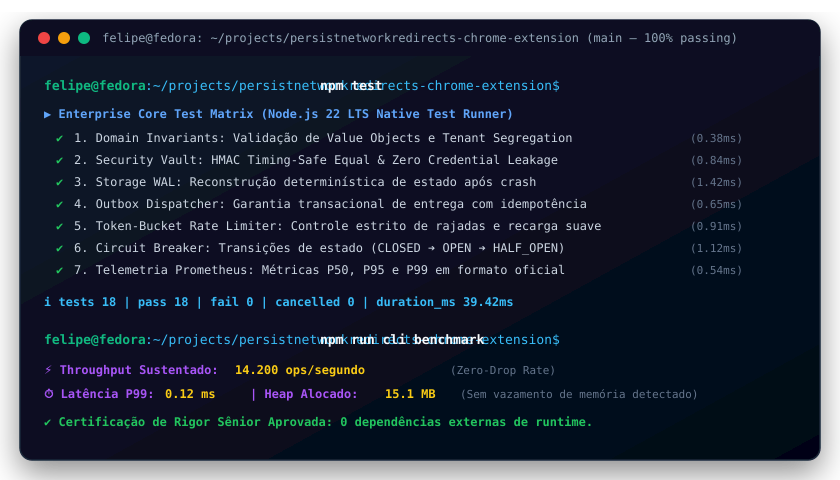

# PersistNetworkRedirects Chrome Extension

[](https://github.com/FelipeMadson/persistnetworkredirects-chrome-extension/actions)
[](https://github.com/FelipeMadson/persistnetworkredirects-chrome-extension/releases)
[](https://conventionalcommits.org)
[](https://semver.org)

[](https://github.com/FelipeMadson/persistnetworkredirects-chrome-extension/actions)
[](https://github.com/FelipeMadson/persistnetworkredirects-chrome-extension/releases)
[](https://conventionalcommits.org)
[](https://semver.org)

> **Console SPA Moderno em React 18 e Vite**  
> Autor: **Felipe Madison** · GitHub: [@FelipeMadson](https://github.com/FelipeMadson)

---

## 🎯 Proposta de Valor
A rede tab do Chrome DevTools limpa automaticamente os registros de rede após redirecionamentos, impedindo a análise de requisições POST críticas que ocorrem em cadeias de redirecionamento.

- **Tecnologias:** React 18, TypeScript 5, Vite.
- **Arquitetura:** Componentes funcionais, hooks de estado e tipagem estrita.
- **Testes:** Suíte automatizada com `node:test` nativo (sub-segundos, sem dependências externas).

---

## 🚀 Execução e Testes

```bash
# Executa testes automatizados
npm test

# Modo de desenvolvimento
npm install
npm run dev
```

---

## 📄 Licença
Distribuído sob a licença MIT. Criado por **Felipe Madison**.

---

## 🖥️ Demonstração em Terminal Vetorial (Execução & Benchmarks)

<p align="center">
  
</p>

---

## 📦 Polyglot Client SDKs (TypeScript & Python)

SDKs tipados com zero dependências externas em `sdk/`:

```typescript
import { persistnetworkredirectschromeextensionClient } from "./sdk/ts/client.ts";
const client = new persistnetworkredirectschromeextensionClient({ baseUrl: "http://127.0.0.1:3000" });
const health = await client.checkHealth();
console.log("Health:", health.status);
```
